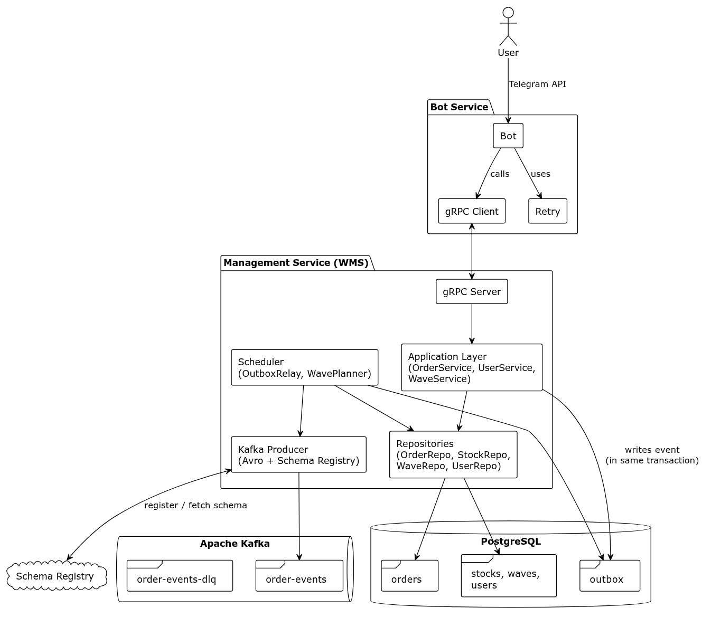
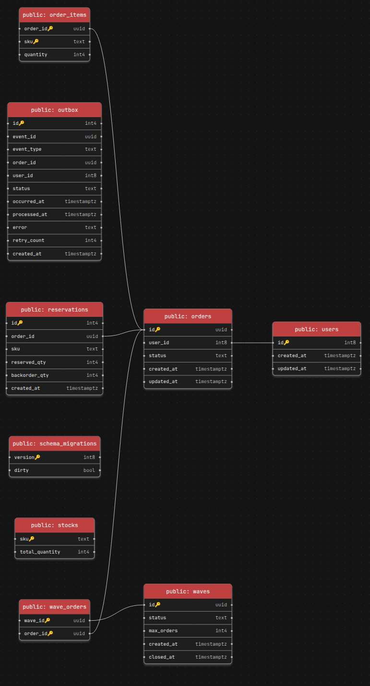

# Warehouse Management System

Система управления заказами. Позволяет создавать и отслеживать заказы, резервировать товары, формировать волны отгрузки.

Проект состоит из двух сервисов:

- **management** — core domain: gRPC API для управления заказами, товарами и волнами
- **bot** — supporting subdomain: telegram bot для взаимодействия с пользователем



- [Технологии](#технологии)
- [Данные](#модель-хранения-данных)
- [Проблемы и их решения](#проблемы-и-их-решения)  
- [Архитектура](#архитектура)  
- [Тестирование](#тестирование)
- [Мониторинг](#мониторинг)
- [Использование](#запуск)

## Технологии

- Go 1.26+
- [gRPC](https://github.com/grpc/grpc-go)
- [Kafka](https://github.com/segmentio/kafka-go)
- [PostgreSQL (pgx driver)](https://github.com/jackc/pgx)
- [Uber FX](https://github.com/uber-go/fx)
- [gocron](https://github.com/go-co-op/gocron)
- Docker / Docker Compose

## Модель хранения данных

### PostgreSQL



### Kafka

Топик `order-events` - события изменения статусов заказов.
Сериализация [Avro Schema](deploy/schemas/order-event-value.json).

## Архитектура

```md
├── api
│   └── proto
├── cmd - входные точки для сервисов, сборка через di контейнеры(uber-fx, fx-modules)
│   ├── bot
│   └── management
├── config - работа с переменными окружения
├── deploy - docker-compose, dockerfile, поднятие приложения
│   ├── docker*
│   ├── schemas
│   └── scripts
├── docs - диаграммы и некоторые доп сведения о проекте
├── internal
│   ├── api
│   │   └── proto - сгенерированный код для grpc clinet/server через protoc
│   │       └── wms 
│   ├── bot - supporting subdomain service
│   │   ├── application
│   │   └── infrastructure
│   │       ├── grpc
│   │       ├── kafka
│   │       └── telegram
│   └── wms - core domain service
│       ├── application
│       ├── domain
│       └── infrastructure
│           ├── grpc
│           ├── kafka
│           ├── repository
│           └── scheduler
├── Makefile
├── migrations - psql migrations
├── pkg
│   └── retry - реализованный retry backoff with jitter
└── README.md
```

Подробнее: тут [docs](docs/),  и тут [docs/architecture.md](docs/architecture.md)

## Проблемы и их решения

- **Гарантия доставки событий при изменении агрегата**  
  Решение: Transactional Outbox — событие пишется в таблицу `outbox` в рамках транзакции, фоновый relay процесс отправляет их в Kafka.

- **Частичное резервирование и backorder при нехватке товаров**  
  Решение: атомарные операции резервирования с учётом доступного остатка и создание backorder для заказа.

- **Масштабируемая пагинация больших наборов данных**  
  Решение: Cursor-based pagination по `(created_at, id)` вместо смещения `offset + limit`.

- **Управление состояниями заказа и корректные переходы**  
  Решение: OrderFSM — конечный автомат с таблицей переходов и guard моделью.

## Тестирование

Подходы к написанию тестов - table-driven tests и Given–When–Then, используемые инструменты:

- [testing](https://pkg.go.dev/testing) - std пакет для написания тестов
- [testify](https://github.com/stretchr/testify) - проверка условий и результатов
- [uber-go/mock](https://github.com/uber-go/mock) - мокогенерация для используемых зависимостей в unit тестах

## Мониторинг

TODO: Prometheus & Grafana, Loki - tbd

## Запуск

- Start in containers:

```bash
cd deploy
cp .env.example .env
docker compose up -d --build
```

- Testing:

```bash
// из корня проекта
make test
make test-race

make html_test //
```

- Tools

```bash
make fmt // go formatter

make lint // golangci-lint

make clean // clean parent dir 
```
