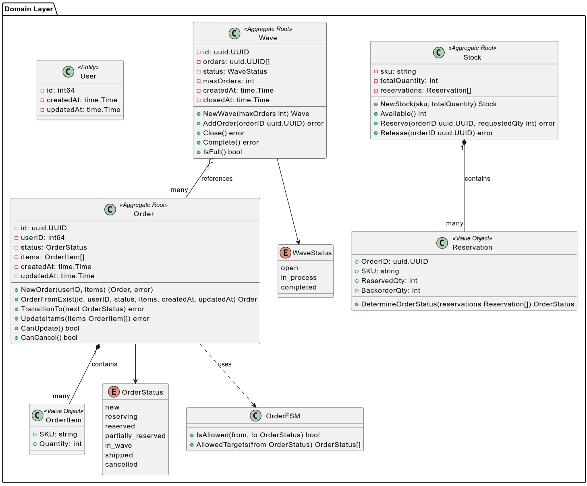
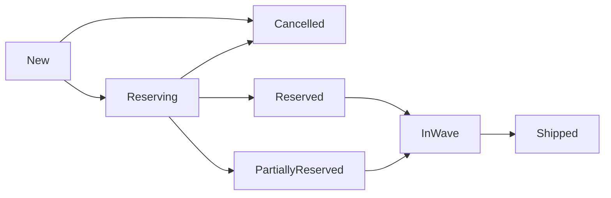
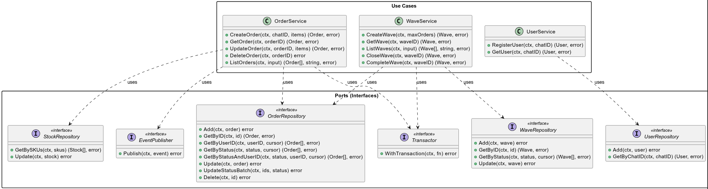

# Architecture

## 1. Общая архитектура

Архитектура проекта разделена на два изолированных поддомена (Service-Oriented Architecture):

- **management(core domain)** - основное бизнес-ядро системы, предоставляет gRPC сервис для управления заказами, товарными запасами и волнами сборки.
- **bot(supporting subdomain)** - вспомогательный сервис взаимодействия выступающий в роли интерфейса для конечного пользователя.


### Изоляция слоев

Компоненты внутри `internal/wms/` разделены на три уровня, где зависимости направлены извне внутрь: **Infrastructure → Application → Domain**, при разделении овтетсвенности использовал паттерны из DDD.

- **Domain** - доменная логика, агрегаты и инварианты, не имеет внешних импортов
- **Application** - сценарии использования, объявляет интерфейсы для взаимодействия с внешними компонентами/сервисами и координируют пользовательские сценарии
- **Infrastructure** - реализация интервейсов для взаимодествия с другими компонентами/сервисами: grpc сервер, работа с scheduler, kafka, postgreSQL

## 2. internal/wms/domain



### Сущности и агрегаты (DDD)

- **Order** - agregate заказа, управляет своим составом и жизненным циклом
- **OrderItem** - value object, задающий позицию в заказе: сочетание SKU (Stock Keeping Unit) и требуемого количества, не имеет собственного identity
- **Stock** - agregate управление товарным запасом конкретного SKU, инвариант доступного остатка
- **Reservation** - запись о резервировании товара под заказ с указанием объема, зафиксированного на складе, и объема в `backorder`
- **Wave** - волна отправки, группирует заказы для оптимизации процесса отправки

### OrderFSM

Для контроля переходов состояний заказа используется **Finite State Machine**, позволит инкапсулировать логику и корректность переходов:



- `TransitionTo()` выполняет валидацию статуса через guard методы `IsAllowed()`, `CanUpdate()` и `CanCancel()`, блокируя любые неконсистентные изменения сущности

## 3. internal/wms/application



### Паттерн Unit of Work / Transactor

Для реализации транзакционной целостности на уровне сценариев использования используется интерфейс `Transactor`, он позволяет слою приложения выполнять несколько операций в рамках одной атомарной транзакции, оставаясь полностью изолированным от спецификаций конкретной базы данных:

```go
type Transactor interface {
    WithTransaction(ctx context.Context, fn func(ctx context.Context) error) error
}
```

### Гарантия доставки событий: Transactional Outbox

Для решения проблемы когда необходимо одновременно обновить состояние в БД и отправить событие в очередь брокера используется паттерн **Transactional Outbox**:

1. При изменении статуса агрегата `Order`, в рамках одной транзакции, обновляются данные в таблице заказов и записывается событие `OrderEvent` в таблицу `outbox`.
2. Событие строго типизировано и соответствует [Avro Schema](/deploy/schemas/order-event-value.json).
3. Асинхронный фоновый процесс (Outbox Relay) считывает записи из таблицы `outbox`, публикует их в Kafka и помечает как обработанные.

### Оптимизация выборок: Cursor-based Pagination

Для сценариев листинга (`ListOrders`, `ListWaves`) вместо использовани конструкции `OFFSET + LIMIT` используется **Cursor-based (Keyset) пагинация**:

- Курсор - base64-строка, состоящая `(created_at, id)` последней записи с предыдущей страницы.
- Это позволит использовать эффективный поиск по индексу, избегая полного сканирования строк и полной загрузки в память.

## 4. internal/wms/infrastructure

Адаптеры слоя переводят внешние технические протоколы и вызовы в доменные структуры приложения. Сборка всех компонентов и управление их жизненным циклом, graceful shutdown для grpc сервера, kafka producer, scheduler осуществляется с помощью DI-контейнера **Uber FX** и управления их жизненным циклом

### Репозитории и транзакции

Для поддержки транзакций, инициированных `Transactor` на уровне application, используется функция-хелпер для динамического извлечения активной транзакции из контекста:

```go
func GetQuerier(ctx context.Context, defaultQuerier Querier) Querier {
    if tx, ok := ctx.Value(txKey{}).(pgx.Tx); ok {
        return tx
    }
    return defaultQuerier
}
```

Модель хранения данных и связи между таблицами:


### gRPC Transport

- **Кодогенерация** - для полного соответсвия proto контракту используется кодогенерация посредсвом `protoc`, а нам остается только реализовать необходимый интерфейс, что обеспечит полную совместивость с контрактом и скорость разработки
- **Rate Limiting Interceptor**: для защиты сервера от перегрузок и большого кол-ва запросов на уровне grpc сервера используется unary-interceptor, использующий алгоритм [Token Bucket](`golang.org/x/time/rate`).

### Асинхронное взаимодействие (Kafka & Scheduler)

- **Kafka Producer**: используется совместно с Confluent Schema Registry для обеспечения обратной совестимости с версиями сообщений. Публикация событий из Outbox-таблицы происходит с гарантиями доставки **At-Least-Once**. Конфигурация кластера брокеров (`min.insync.replicas=2`, `acks=all`) минимизирует риски потери сообщений при сбое нод.
- **Планировщик задач (gocron)**: Изолированно запускает три независимых фоновых процесса:
  1. *Outbox Relay* - поллинг и стриминг накопленных событий в Kafka.
  2. *Wave Planner* - запуск алгоритма группировки заказов в волны сборки при достижении критической массы заказов в статусе `Reserved`.
  3. *Cleanup Task* - очистка устаревших и успешно обработанных outbox-событий для предотвращения разрастания таблицы outbox.
